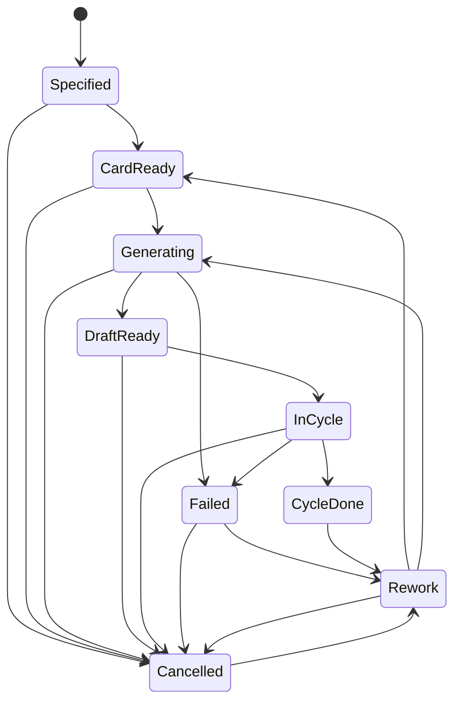
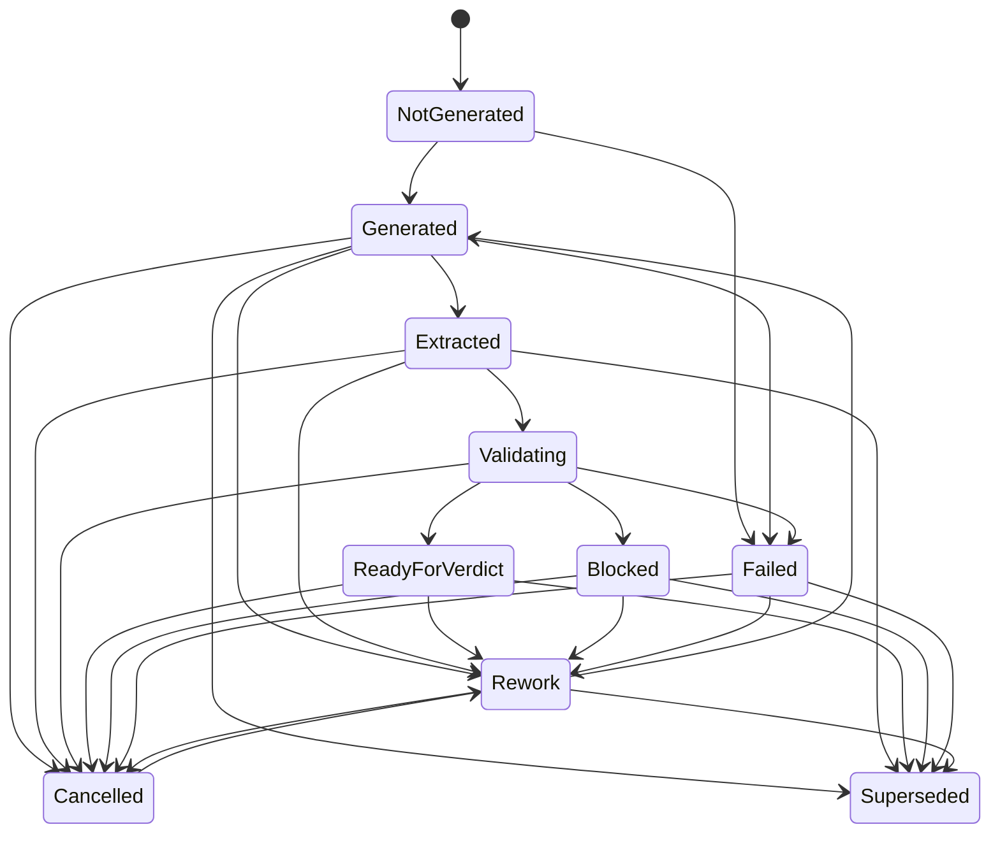
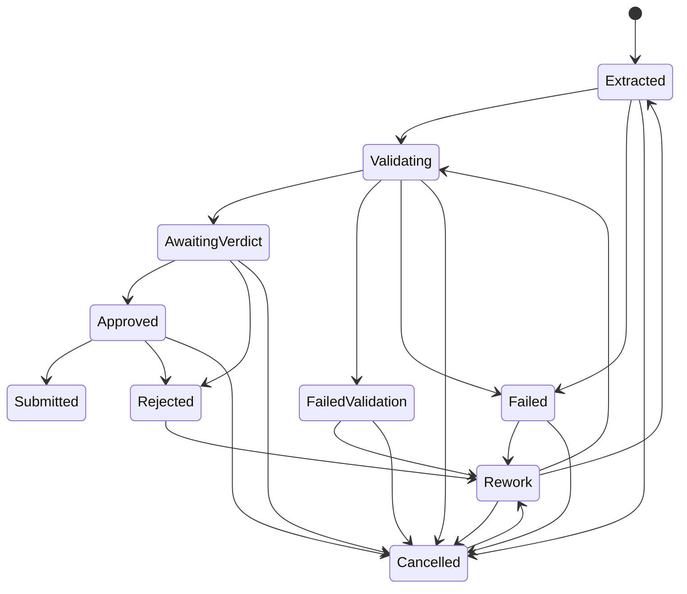
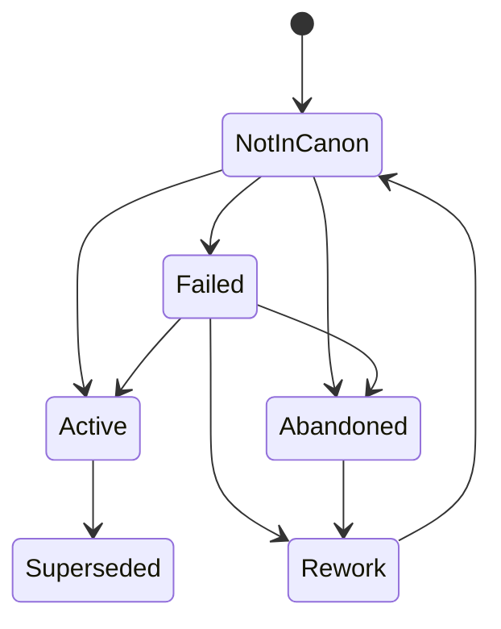
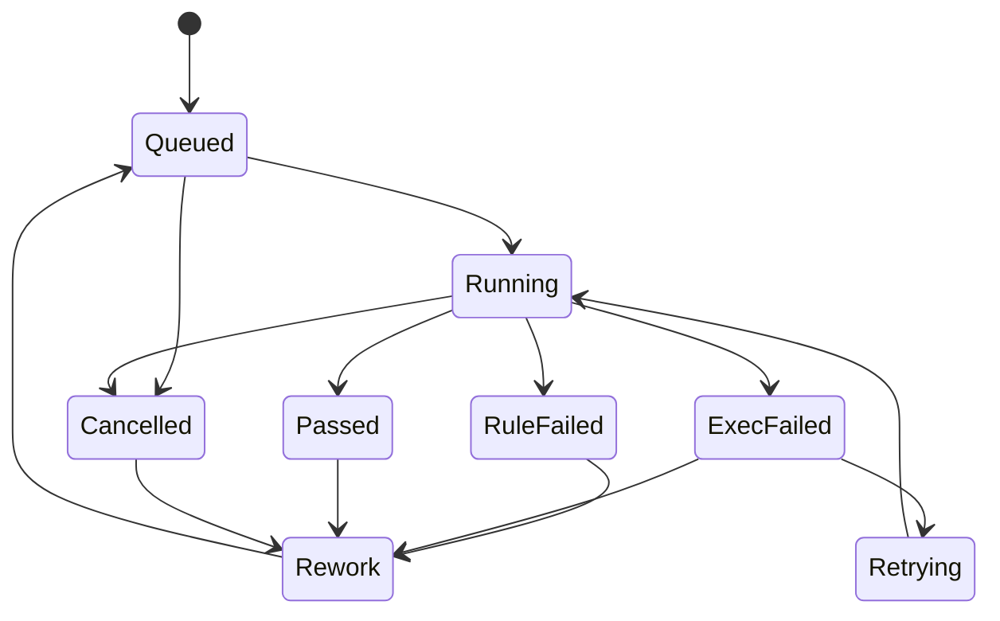
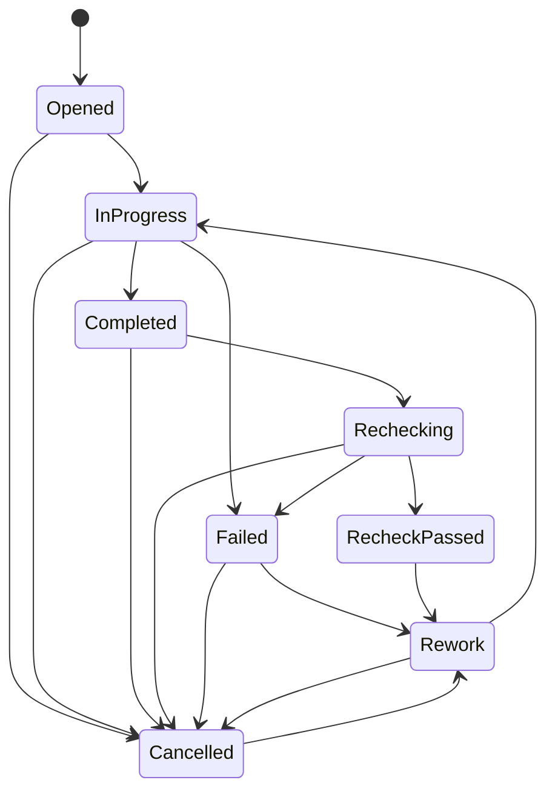
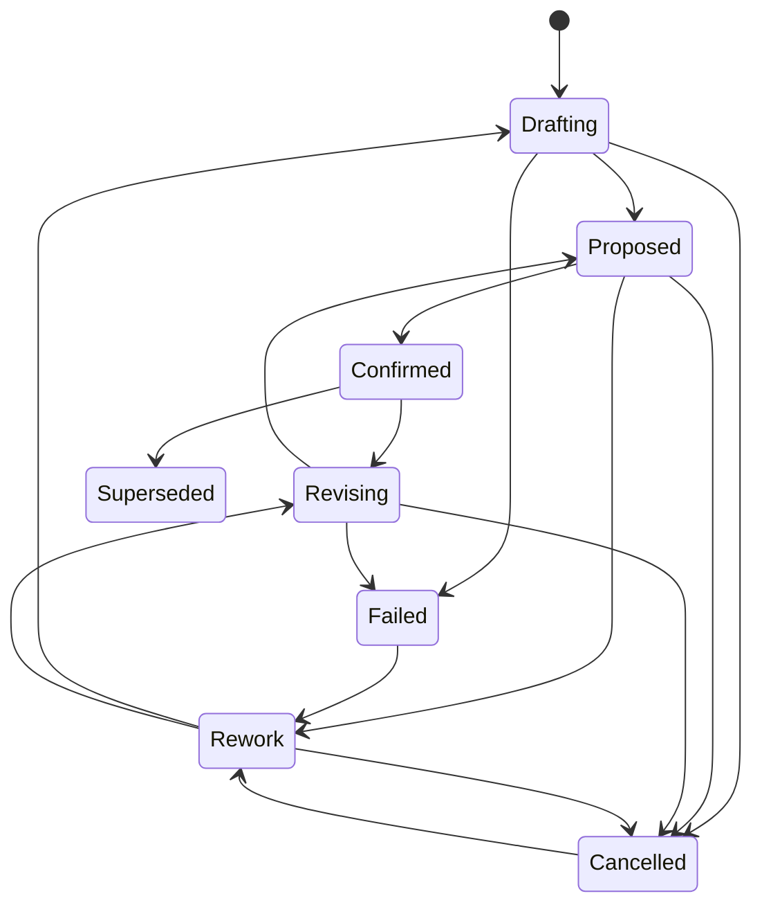

# 状态机（节点 0.3）

本文只冻结节点 0.3 的状态机。不启动 0.4。不写实现、SQL、API 或库表。  
术语必须与节点 0.1（`docs/mvp-scope.md`）和节点 0.2（`docs/domain-glossary.md`）一致，不新增产品术语，不改写已冻结定义。

**Validation Run**：0.1 `Validate` 的一次执行实例，不是新术语。  
**Outline Revision**：0.2 `Outline` 的一次 `Revision`，不是新术语。大纲修订不自动改 Canon。

图内状态名为 ASCII，便于渲染；中文名见各节状态列表与表。

---

## 0. 硬约束（验收必读）

与 0.1 / 0.2 对齐，下列为 MVP 正常行为：

- 一个故事项目、一名用户（创作者兼主编）、仅中文、一个写作模型供应商、生成单位为场景、必须人类批准。
- **自动批准不是 MVP 正常行为。** 不存在自动批准路径。
- **多项目不是 MVP 正常行为。**
- 场景草稿与 Canon 冲突时，**Canon 胜**。
- 模型、实现 bot、验收 bot、生成 Agent、审校 Agent、系统均不得批准 Canon，也不得把候选写成 Canon 事实。
- **只有人工主编可以批准。** 批准候选变更是人类转换；成为 Canon 事实必须「人工批准 → 人工提交」，不得自动完成。
- 候选变更不能自动变成 Canon 事实。
- 场景草稿不能直接成为发表物；必须先经 Validate。
- Canon 事实不得就地改写；只能退役/废弃并由新版本覆盖（supersede）。
- 失败、取消、重试、返工都是一等状态或进入这些状态的显式转换。禁止「直接删除记录」来收场。
- 每条转换必须可审计。下列各表「转换后副作用」均默认包含：写入审计（对象、标识、从、到、触发者、时间）。

**触发者只允许**：`系统` / `生成 Agent` / `审校 Agent` / `人工主编`。

**谁可以批准（全局）**

| 动作 | 允许触发者 | 禁止 |
| --- | --- | --- |
| 批准 Candidate Change | 仅人工主编 | 系统、生成 Agent、审校 Agent、模型、实现 bot、验收 bot |
| 提交并因此创建或覆盖 Canon Fact | 仅人工主编 | 同上；批准本身不写 Canon |
| Validate 通过、修复完成、大纲确认可用 | 不是批准 | 不得当作批准或写 Canon |

---

## 1. Scene（场景）

0.2：指定待写 → 持有场景卡 → 已生成草稿 → 抽取/校验/裁决后可进入下一场景。不得一次生成整章或全书。

### 1.1 状态列表

| ASCII | 中文 | 含义 |
| --- | --- | --- |
| Specified | 指定待写 | 主编指定本场，尚无场景卡 |
| CardReady | 持有场景卡 | 本场已有 Scene Card |
| Generating | 生成中 | 按该卡生成一场散文 |
| DraftReady | 已生成草稿 | 本场已绑定 Scene Draft |
| InCycle | 抽取校验裁决中 | 抽取 / Validate / 人类裁决进行中 |
| CycleDone | 本场闭环 | 本场候选均已到终态，可指定下一场 |
| Failed | 失败 | 生成或闭环执行失败；记录保留 |
| Cancelled | 已取消 | 主编取消本场；记录保留 |
| Rework | 返工 | 失败、取消或闭环后的再来 |

### 1.2 图

### 1.3 允许转换

| 从 | 到 | 触发者 | 前置条件 | 转换后副作用 |
| --- | --- | --- | --- | --- |
| Specified | CardReady | 人工主编 | 唯一故事项目；本场已指定；主编写定该场 Scene Card | 归档场景卡；写审计。不改 Canon |
| CardReady | Generating | 生成 Agent | 有场景卡；本场未闭环；只生成这一场 | 开始按卡生成；写审计。不改 Canon |
| Generating | DraftReady | 生成 Agent | 生成完成并产出 Scene Draft | 绑定本场草稿；写审计。不改 Canon |
| Generating | Failed | 系统 | 生成执行失败 | 保留失败记录，不删除场景；写审计 |
| DraftReady | InCycle | 系统 | 本场已有草稿 | 启动抽取；写审计。不改 Canon |
| InCycle | CycleDone | 系统 | 本场候选均已到终态（已提交 / 已拒绝 / 未通过后修复闭环 / 已取消）。**不要求**存在批准 | 允许主编指定下一场；写审计。不改 Canon、不批准 |
| InCycle | Failed | 系统 | 抽取或校验执行失败（不是规则未通过） | 保留现场；可开 Repair Task；不删除；写审计 |
| Failed | Rework | 人工主编 | 失败记录仍在；主编选择返工而非结束 | 进入返工；不删除；写审计 |
| CycleDone | Rework | 人工主编 | 本场已闭环，主编要求再写一版 | 开修订意图；写审计。不自动改 Canon |
| Rework | CardReady | 人工主编 | 主编选择改卡后重来 | 旧卡归档；写审计。不改 Canon |
| Rework | Generating | 生成 Agent | 卡仍有效；主编允许重生成 | 新草稿将作为 Revision；写审计 |
| Specified / CardReady / Generating / DraftReady / InCycle / Failed / Rework | Cancelled | 人工主编 | 主编明确取消；不删除记录 | 停止本场生成；已有草稿与候选保留并按取消关联；写审计 |
| Cancelled | Rework | 人工主编 | 主编恢复本场 | 从取消回到返工；写审计 |

### 1.4 禁止转换与原因

- Specified → DraftReady / InCycle / CycleDone：跳过场景卡或闭环，违反 0.2 生命周期。
- CardReady → CycleDone：未生成、未抽取、未校验、未裁决。
- 任一状态 → 一次生成整章或全书：超出场景级生成。
- 场景或草稿直接写入 Canon：散文只可产生候选变更。
- 系统 / 生成 Agent / 审校 Agent 把本场标为已批准：无自动批准；场景闭环不是批准。
- 失败或取消后删除场景记录：失败、取消、返工须保留。

---

## 2. Scene Draft（场景草稿）

0.2：未生成 → 已生成 → 已抽取候选变更 → 可出修订版本。草稿与 Canon 冲突时，Canon 胜。  
**冻结**：草稿不能直接成为发表物；必须经过 Validate。

### 2.1 状态列表

| ASCII | 中文 | 含义 |
| --- | --- | --- |
| NotGenerated | 未生成 | 尚无散文 |
| Generated | 已生成 | 已有散文，尚未抽取或抽取未完成 |
| Extracted | 已抽取候选变更 | 已抽出候选并绑定 Evidence |
| Validating | 校验中 | 对照 Canon 与 Story Spec 做 Validate |
| ReadyForVerdict | 可交裁决 | 校验通过，候选可待主编裁决。**不是发表** |
| Blocked | 已阻断 | 未通过，或与 Canon 冲突（Canon 胜） |
| Failed | 失败 | 生成、抽取或校验执行失败 |
| Cancelled | 已取消 | 主编取消该版草稿 |
| Rework | 返工 | 待出修订版本 |
| Superseded | 已被替换 | 同场更新 Revision 已成为当前草稿 |

无「已发表 / Published」状态。

### 2.2 图

### 2.3 允许转换

| 从 | 到 | 触发者 | 前置条件 | 转换后副作用 |
| --- | --- | --- | --- | --- |
| NotGenerated | Generated | 生成 Agent | 所属 Scene 持有场景卡且处于生成中 | 产出散文；写审计。不写 Canon、不发表 |
| NotGenerated | Failed | 系统 | 生成执行失败 | 保留失败草稿对象，不删除；写审计 |
| Generated | Extracted | 生成 Agent | 已有草稿文本 | 抽出 Candidate Change 并绑定 Evidence；写审计。不写 Canon |
| Generated | Failed | 系统 | 抽取执行失败 | 保留草稿；写审计 |
| Extracted | Validating | 系统 | 每条候选已绑定 Evidence | 开 Validation Run；写审计。不写 Canon |
| Validating | ReadyForVerdict | 审校 Agent | Validation Run 通过 | 候选可进待主编裁决；草稿仍是散文、不是发表物；写审计。不批准、不写 Canon |
| Validating | Blocked | 审校 Agent | 检出 Violation，或草稿与已有 Canon / Canon Fact 冲突 | **Canon 胜**；冲突段不得覆盖 Canon；未通过者不得进入批准；可开 Repair Task；写审计 |
| Validating | Failed | 系统 | 校验执行失败（不是规则未通过） | 保留草稿与部分结果，不删除；写审计 |
| Generated / Extracted / ReadyForVerdict / Blocked / Failed | Rework | 人工主编 | 主编要求出修订版本 | 进入返工；写审计。已有候选不自动批准 |
| Rework | Generated | 生成 Agent | 返工指定重生成或改写 | 产生新 Revision；旧版将可被替换；写审计。不写 Canon |
| Generated / Extracted / Validating / ReadyForVerdict / Blocked / Failed / Rework | Cancelled | 人工主编 | 主编取消该版 | 不删除；关联候选按取消处理；写审计 |
| Cancelled | Rework | 人工主编 | 主编恢复该草稿线 | 写审计 |
| Generated / Extracted / ReadyForVerdict / Blocked / Failed / Rework | Superseded | 系统 | 同场已有更新 Revision，且主编以新版为当前草稿 | 旧版只读保留，不发表、不删除；写审计 |

### 2.4 禁止转换与原因

- 任一状态 → 已发表 / Published：无此状态；草稿不能直接成为发表物。
- ReadyForVerdict → 写入 Canon / 充当 Canon Fact：校验通过只表示可交裁决。
- Generated → ReadyForVerdict：跳过抽取与 Validate。
- Extracted → ReadyForVerdict：跳过 Validate。
- Blocked → ReadyForVerdict：未通过或与 Canon 冲突者不得进入批准；Canon 胜。
- 草稿覆盖、改写或充当 Canon：违反 0.1 / 0.2。
- 系统 / 生成 Agent / 审校 Agent 把草稿标为已批准或已发表：无自动批准。
- 失败或取消后删除草稿：须保留并走失败 / 取消 / 返工。

---

## 3. Candidate Change（候选变更）

0.2：已抽取 → 校验中 → 未通过（不得进入批准）/ 待主编裁决 → 批准并提交 / 拒绝。不存在自动批准。  
**冻结**：候选变更不能自动变成 Canon 事实。批准是人类转换；成为 Canon 事实还须再经人工提交。

本对象终态仍是「候选」。**不存在**「Candidate Change → Canon Fact」状态跃迁。提交的副作用是另建或覆盖一条 Canon 事实。

### 3.1 状态列表

| ASCII | 中文 | 含义 |
| --- | --- | --- |
| Extracted | 已抽取 | 已抽出且已绑 Evidence |
| Validating | 校验中 | 进入 Validate，尚未出结果 |
| FailedValidation | 未通过 | 不得进入批准 |
| AwaitingVerdict | 待主编裁决 | 已通过校验，等待人类裁决 |
| Approved | 已批准未提交 | 主编已批准；Canon 尚未改 |
| Rejected | 已拒绝 | 主编拒绝；不提交 |
| Submitted | 已提交 | 主编已执行提交；对应 Canon 事实在另一对象上诞生或被覆盖 |
| Failed | 失败 | 抽取后或校验执行失败 |
| Cancelled | 已取消 | 主编撤回该候选 |
| Rework | 返工 | 修复后重抽或重校验 |

### 3.2 图

### 3.3 允许转换

| 从 | 到 | 触发者 | 前置条件 | 转换后副作用 |
| --- | --- | --- | --- | --- |
| Extracted | Validating | 系统 | 已绑定 Evidence | 纳入 Validation Run；写审计。不批准、不写 Canon |
| Extracted | Failed | 系统 | 进入校验前执行失败 | 不得进入批准；不删除；写审计 |
| Validating | AwaitingVerdict | 审校 Agent | Validation Run 通过 | 可交主编裁决；写审计。**不批准**、不写 Canon |
| Validating | FailedValidation | 审校 Agent | 未通过 Validation Rule | 不得进入批准；可开 Repair Task；写审计 |
| Validating | Failed | 系统 | 校验执行失败 | 不得进入批准；不删除；写审计 |
| AwaitingVerdict | Approved | 人工主编 | 已通过校验；裁决者是创作者兼主编本人 | 只记录批准；写审计。**不写 Canon** |
| AwaitingVerdict | Rejected | 人工主编 | 已通过校验 | 不提交；Evidence 随候选归档；写审计 |
| Approved | Submitted | 人工主编 | 该候选已处于已批准；主编亲自执行提交 | 此时才创建新 Canon Fact，或 supersede 旧 Canon Fact；本对象保持为已提交的候选，**不变成** Canon Fact；写审计 |
| Approved | Rejected | 人工主编 | 提交前主编改判拒绝 | 不写 Canon；写审计 |
| FailedValidation / Failed / Rejected | Rework | 人工主编 | 记录仍在；主编要求返工 | 可开 Repair Task；不删除；写审计。不批准 |
| Rework | Extracted | 生成 Agent | 返工要求重抽；仍须有 Evidence 来源 | 新 Evidence 绑定；写审计。不写 Canon |
| Rework | Validating | 系统 | 修复后仍绑定 Evidence，只需重校验 | 重新进入 Validate；写审计 |
| Extracted / Validating / FailedValidation / AwaitingVerdict / Approved / Failed / Rework | Cancelled | 人工主编 | 主编撤回；不删除 | 不写 Canon；写审计 |
| Cancelled | Rework | 人工主编 | 主编恢复该候选 | 写审计 |

### 3.4 禁止转换与原因

- Extracted / Validating / Failed / FailedValidation / Rework / Cancelled → Approved：跳过校验或非人类批准；无自动批准。
- 任一状态（含 Approved）被系统 / 生成 Agent / 审校 Agent 标为 Approved 或 Submitted：只有人工主编可以批准和提交。
- FailedValidation → AwaitingVerdict / Approved / Submitted：未通过者不能进入批准。
- AwaitingVerdict → Submitted：跳过「先批准再提交」。
- Approved 自动 → Submitted：提交不得自动发生。
- 本对象任一状态 → Canon Fact 的某一状态：候选不能变成事实；只允许提交副作用去创建/覆盖另一对象。
- 拒绝、失败、取消后删除候选：须保留。

---

## 4. Canon Fact（Canon 事实）

0.2：尚未进入 Canon → 对应候选被主编批准并提交后成为已提交 → 若被新的批准提交替换则进入被覆盖。未批准前不是 Canon 事实。  
**冻结**：不得就地编辑；只能退役/废弃并由新版本覆盖（supersede）。

### 4.1 状态列表

| ASCII | 中文 | 含义 |
| --- | --- | --- |
| NotInCanon | 尚未进入 Canon | 对应候选已指向该陈述，但还不是 Canon 事实，不得当真相 |
| Active | 已提交 | 已在 Canon 中生效 |
| Superseded | 被覆盖 | 已被新版本替换；本记录退役/废弃，只读保留 |
| Failed | 失败 | 提交执行失败；Canon 未改 |
| Abandoned | 已废弃 | 尚未生效即被主编放弃（对应候选拒绝或取消） |
| Rework | 返工 | 尚未生效的陈述改走新的候选路径；不是就地改 Active |

无「就地编辑 / 内容已改」状态。生效后的唯一变更是 supersede。

### 4.2 图

### 4.3 允许转换

| 从 | 到 | 触发者 | 前置条件 | 转换后副作用 |
| --- | --- | --- | --- | --- |
| NotInCanon | Active | 人工主编 | 对应 Candidate Change 已处于 Approved；主编亲自提交；该陈述此前不是 Canon 事实 | 在 Canon 中新增一条已批准真相；写审计。**不是**候选自动变成事实 |
| NotInCanon | Failed | 系统 | 主编已发起提交但执行失败 | Canon 不变；不删除记账；写审计 |
| NotInCanon | Abandoned | 人工主编 | 对应候选已被拒绝或取消 | 永不进入 Canon；记录保留；写审计 |
| Failed | Active | 人工主编 | 对应候选仍为 Approved；主编再次提交 | 与首次提交相同；写审计。属于重试，不是自动批准 |
| Failed | Abandoned | 人工主编 | 主编放弃这次提交 | Canon 仍未改；写审计 |
| Failed / Abandoned | Rework | 人工主编 | 记录仍在；要换一条候选再试 | 不就地改正文；写审计 |
| Rework | NotInCanon | 系统 | 已有新的已抽取候选指向同一陈述意图 | 重新等待「批准 → 提交」；写审计。不生效 |
| Active | Superseded | 人工主编 | 另有一条 Candidate Change 已 Approved，且主编将其提交为对本事实的替换 | 本记录退役/废弃并只读保留，**不改本记录正文**；新版本以新的 Canon Fact 进入 Active；写审计 |

### 4.4 禁止转换与原因

- Active → Active（改字段 / 改正文 / 打补丁）：禁止就地编辑。
- 系统 / 生成 Agent / 审校 Agent：NotInCanon → Active，或 Failed → Active：只有人工主编可提交。
- NotInCanon → Active 但对应候选未 Approved，或无人提交：违反「先批准再提交」。
- Candidate Change 状态直接变成本对象状态：候选不能自动变成 Canon 事实。
- Active → Abandoned 且无新版本：生效事实只能 supersede（退役/废弃并替换）。
- 用快照、草稿或大纲覆盖当前 Canon Fact：快照只读；草稿与大纲不改 Canon。
- 失败或废弃后删除事实记账：须保留。

---

## 5. Validation Run（一次 Validate 执行）

0.1：对照 Canon 与 Story Spec 检查候选变更是否可提交人类裁决。未通过者不能进入批准。规则本身不改 Canon。

### 5.1 状态列表

| ASCII | 中文 | 含义 |
| --- | --- | --- |
| Queued | 已开立 | 已创建，尚未跑规则 |
| Running | 校验中 | 正在按 Validation Rule 检查 |
| Passed | 已通过 | 候选可交裁决；**不是批准** |
| RuleFailed | 未通过 | 检出 Violation；不得进入批准 |
| ExecFailed | 执行失败 | 运行中断；不视为通过 |
| Cancelled | 已取消 | 主编取消本次执行 |
| Retrying | 重试中 | 执行失败后准备再跑 |
| Rework | 返工 | 须先修再校验 |

### 5.2 图

### 5.3 允许转换

| 从 | 到 | 触发者 | 前置条件 | 转换后副作用 |
| --- | --- | --- | --- | --- |
| Queued | Running | 审校 Agent | 待检候选均已绑 Evidence；对照当前 Canon 与已写定 Story Spec | 开始检查；写审计。不改 Canon、不批准 |
| Queued | Cancelled | 人工主编 | 尚未开始 | 保留本次记录；写审计 |
| Running | Passed | 审校 Agent | 全部规则通过 | 候选可进待主编裁决；写审计。**不批准**、不写 Canon |
| Running | RuleFailed | 审校 Agent | 检出 Violation | 阻断进入批准；可开 Repair Task；写审计 |
| Running | ExecFailed | 系统 | 执行中断 | 不视为通过；不删除；写审计 |
| Running | Cancelled | 人工主编 | 主编取消本次 | 保留记录；写审计 |
| RuleFailed | Rework | 人工主编 | 已有 Violation | 开 Repair Task；写审计。不批准 |
| ExecFailed | Retrying | 系统 | 执行失败且可重试 | 旧结果保留；写审计 |
| ExecFailed | Rework | 人工主编 | 主编选择先修再跑 | 写审计 |
| Retrying | Running | 审校 Agent | 仍满足 Evidence 前置 | 再跑一轮；写审计 |
| Rework | Queued | 系统 | Repair Task 已完成后必须再校验 | 开后续轮次；写审计。不批准 |
| Passed | Rework | 人工主编 | 草稿或候选已出修订，须再校验 | 旧通过结果归档；写审计 |
| Cancelled | Rework | 人工主编 | 主编恢复校验意图 | 写审计 |

### 5.4 禁止转换与原因

- Passed → 批准 / 提交 / 写 Canon：通过只表示可交裁决。
- RuleFailed → Passed / AwaitingVerdict / Approved：未通过者不能进入批准；不得靠自动批准抹掉违规。
- 系统 / 生成 Agent / 审校 Agent 把本次标为批准：Validate 不是 Approval。
- 取消或失败后删除本次执行：须保留。

---

## 6. Repair Task（修复任务）

0.2：开立 → 进行中 → 完成并再校验。修复完成不等于自动批准，更不等于自动改 Canon。

### 6.1 状态列表

| ASCII | 中文 | 含义 |
| --- | --- | --- |
| Opened | 已开立 | 为消解一次 Violation 而开立 |
| InProgress | 进行中 | 正在改 Scene Plan、重生成或重抽候选 |
| Completed | 已完成待再校验 | 返工动作做完，尚未再校验 |
| Rechecking | 再校验中 | 完成后必须再走 Validate |
| RecheckPassed | 再校验通过 | 候选可交裁决；**不是批准** |
| Failed | 失败 | 返工或再校验失败 |
| Cancelled | 已取消 | 主编取消本任务 |
| Rework | 返工 | 失败或通过后再修 |

### 6.2 图

### 6.3 允许转换

| 从 | 到 | 触发者 | 前置条件 | 转换后副作用 |
| --- | --- | --- | --- | --- |
| Opened | InProgress | 生成 Agent | 存在对应 Violation；动作为改 Scene Plan、重生成或重抽候选 | 开始返工；写审计。不批准、不改 Canon |
| Opened | InProgress | 人工主编 | 同上，且主编亲自改计划或指定返工 | 开始返工；写审计。不批准、不改 Canon |
| InProgress | Completed | 生成 Agent | 指定返工动作已做完 | 不等于批准；必须再校验；写审计 |
| InProgress | Failed | 系统 | 返工执行失败 | 不删除；写审计 |
| Completed | Rechecking | 系统 | 完成后必须再 Validate | 开 Validation Run；写审计 |
| Rechecking | RecheckPassed | 审校 Agent | 再校验通过 | 候选可交裁决；写审计。**不批准**、不改 Canon |
| Rechecking | Failed | 审校 Agent | 再校验未通过 | 不得进入批准；不删除；写审计 |
| Rechecking | Failed | 系统 | 再校验执行失败 | 不删除；写审计 |
| Failed | Rework | 人工主编 | 失败仍在 | 继续修；写审计 |
| RecheckPassed | Rework | 人工主编 | 通过后主编仍要改 | 写审计。不写 Canon |
| Rework | InProgress | 生成 Agent | 主编允许再修 | 写审计 |
| Opened / InProgress / Completed / Rechecking / Failed / Rework | Cancelled | 人工主编 | 主编取消；不删除 | 违规仍在；写审计。不批准 |
| Cancelled | Rework | 人工主编 | 主编恢复修复 | 写审计 |

### 6.4 禁止转换与原因

- Completed / RecheckPassed → Approved / Submitted / 写 Canon：修完只是再次进入抽取与校验。
- Rechecking → 批准：再校验不是 Approval。
- 系统 / 生成 Agent / 审校 Agent 关闭违规并当批准：不得用自动批准消掉违规。
- 完成后删除任务：须保留。

---

## 7. Outline Revision（大纲的一次修订版本）

0.2 Outline：拟定 → 主编确认可用 → 可修订。大纲修订不自动改 Canon。  
0.2 Revision：当前版本 → 产生下一修订版本。大纲不是生成单位。

此处「确认可用」不是 Approval，也不写 Canon。

### 7.1 状态列表

| ASCII | 中文 | 含义 |
| --- | --- | --- |
| Drafting | 拟定中 | 本修订版本尚未提交确认 |
| Proposed | 待主编确认 | 已写定，等待确认可用 |
| Confirmed | 确认可用 | 当前可用的大纲版本；可用来排场景 |
| Revising | 修订中 | 在已确认版本上开下一版 |
| Failed | 失败 | 保存或拟定失败 |
| Cancelled | 已取消 | 主编取消本版 |
| Rework | 返工 | 不接受或失败后再拟 |
| Superseded | 已被替换 | 更新版本已被确认；本版只读保留 |

### 7.2 图

### 7.3 允许转换

| 从 | 到 | 触发者 | 前置条件 | 转换后副作用 |
| --- | --- | --- | --- | --- |
| Drafting | Proposed | 人工主编 | 唯一故事项目；本版已写定；大纲不是生成单位 | 提交确认；写审计。不改 Canon |
| Drafting | Failed | 系统 | 拟定或保存失败 | 不删除；写审计 |
| Drafting | Cancelled | 人工主编 | 主编取消本版 | 不删除；不改 Canon；写审计 |
| Proposed | Confirmed | 人工主编 | 主编确认该修订版本可用 | 该版成为当前大纲；写审计。**不是批准 Canon**、不改 Canon |
| Proposed | Rework | 人工主编 | 主编不接受该稿 | 写审计 |
| Proposed | Cancelled | 人工主编 | 主编取消本版 | 不删除；写审计 |
| Confirmed | Revising | 人工主编 | 当前版已确认，主编要改结构 | 开下一 Revision 意图；旧版在新版确认前仍可用；写审计。不改 Canon |
| Revising | Proposed | 人工主编 | 新修订文本已写定 | 写审计。不改 Canon |
| Revising | Failed | 系统 | 修订保存失败 | 不删除；写审计 |
| Revising | Cancelled | 人工主编 | 主编放弃这一轮修订 | 当前 Confirmed 版仍在；写审计 |
| Failed | Rework | 人工主编 | 失败仍在 | 写审计 |
| Rework | Drafting | 人工主编 | 还没有已确认版本 | 回到拟定；写审计 |
| Rework | Revising | 人工主编 | 已有 Confirmed 版 | 回到修订；写审计 |
| Rework | Cancelled | 人工主编 | 主编结束本版 | 写审计 |
| Cancelled | Rework | 人工主编 | 主编恢复本版 | 写审计 |
| Confirmed | Superseded | 系统 | 已有更新 Outline Revision 被主编确认 | 本版只读保留，不删除；写审计。不改 Canon |

### 7.4 禁止转换与原因

- Proposed → Confirmed 由系统 / 生成 Agent / 审校 Agent 执行：只有人工主编可确认可用。
- Confirmed / Proposed / 任一状态 → 写 Canon / 产生 Canon Fact：大纲修订不自动改 Canon。
- 把大纲当生成单位，一次生成整章或全书：违反场景级生成。
- 确认可用被写成批准：Approval 只作用于通过校验的 Candidate Change。
- 为第二部小说开另一套大纲修订线：多项目不是 MVP 正常行为。
- 失败或取消后删除修订记录：须保留。

---

## 8. 与 0.1 闭环的对照（不引入 0.4）

Story Spec → Canon → Scene Card → Generate → Extract Candidate Changes → Validate → Human Approve/Reject → Commit Canon：

1. Scene：指定待写 → 持有场景卡 → 生成 → 抽取/校验/裁决闭环。
2. Scene Draft：生成散文 → 抽取 → **必须 Validate** → 可交裁决；永不发表、永不直接写 Canon。
3. Candidate Change：抽取 → 校验 → 仅人工主编批准或拒绝 → 仅人工主编提交。
4. Canon Fact：只在人工提交后生效；之后只靠 supersede 换新版本。
5. Validation Run：决定能不能交裁决，不批准。
6. Repair Task：消解 Violation 后再校验，不批准。
7. Outline Revision：排结构，不改 Canon。

---

## 9. 本节点明确不做

- 不启动 0.4，不写实现、接口、库表或代码。
- 不把自动批准、多项目写成 MVP 正常行为或可选正常路径。
- 不增加、不删减上述 7 个对象。
- 不修改 `docs/mvp-scope.md`、`docs/domain-glossary.md`。
